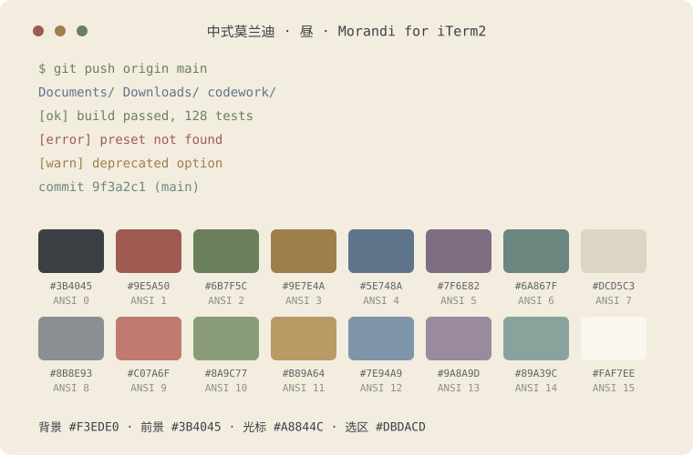
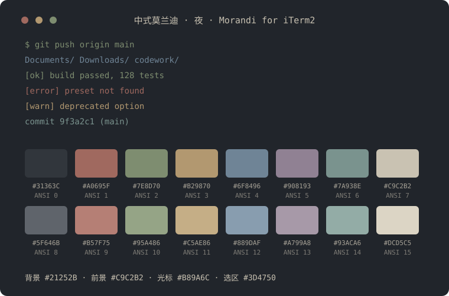

# 中式莫兰迪 · Chinese Morandi for iTerm2

> 低饱和中式传统色的 iTerm2 配色方案,包含「昼」「夜」两个暗色主题,可随 macOS 系统外观自动切换。
>
> A muted, Morandi-style iTerm2 color scheme inspired by traditional Chinese colors, with Day/Night variants that can follow the macOS system appearance.

## 预览 Preview

| 昼 Day | 夜 Night |
|--------|----------|
|  |  |

## 主题 Themes

| 主题 | 背景 | 前景 | 适合场景 |
|------|------|------|----------|
| 莫兰迪·昼 `Morandi-Day` | 玄青 `#2D3236` | 月白 `#DAD4C6` | 白天 |
| 莫兰迪·夜 `Morandi-Night` | 玄黑 `#21252B` | 月白·暗 `#C9C2B2` | 夜晚 |

颜色命名取自传统中国色:朱砂、竹青、缃色、黛蓝、藕荷、天青、青瓷、宣纸……全部做了低饱和的莫兰迪式处理。

## 安装 Install

详见 [INSTALL.md](INSTALL.md)。最快方式:双击 `Morandi-Day.itermcolors` 与 `Morandi-Night.itermcolors` 导入,然后在 `iTerm2 → Settings → Profiles → Colors → Color Presets…` 中选择。

## 昼夜自动切换 Auto Light/Dark Switching

iTerm2 原生支持(≥ 3.5):

1. 先导入两个配色(见上)
2. `Settings → Profiles → 你的 Profile → Colors`
3. 勾选 **Use separate colors for light and dark mode**
4. 用出现的 **Editing** 控件分别给 `Light` 指定 `Morandi-Day`、给 `Dark` 指定 `Morandi-Night`
5. 把 macOS「系统设置 → 外观」设为**自动**,iTerm 配色即随系统昼夜切换

## 演示 Demo

在应用了主题的窗口中运行:

```bash
scripts/color-demo        # 昼
scripts/color-demo night  # 夜
```

会展示 16 色色板、文字样式、git diff / 目录 / 报错等真实场景效果。

## 调整颜色 & 重新生成

色表集中在 [scripts/generate.py](scripts/generate.py) 的 `PALETTES` 中,改完运行:

```bash
python3 scripts/generate.py
```

即可重新生成全部 `.itermcolors`、动态 Profile 与 SVG 预览图。

## 文件结构

```
├── Morandi-Day.itermcolors      # 昼
├── Morandi-Night.itermcolors    # 夜
├── dynamic-profiles/            # iTerm2 动态 Profile(固定配色,快速启用)
├── screenshots/                 # README 预览图(SVG)
├── scripts/
│   ├── generate.py              # 生成器(色表 → 所有产物)
│   └── color-demo               # 终端色板演示
├── INSTALL.md
└── LICENSE
```

## License

[MIT](LICENSE) © mattliu-cd
